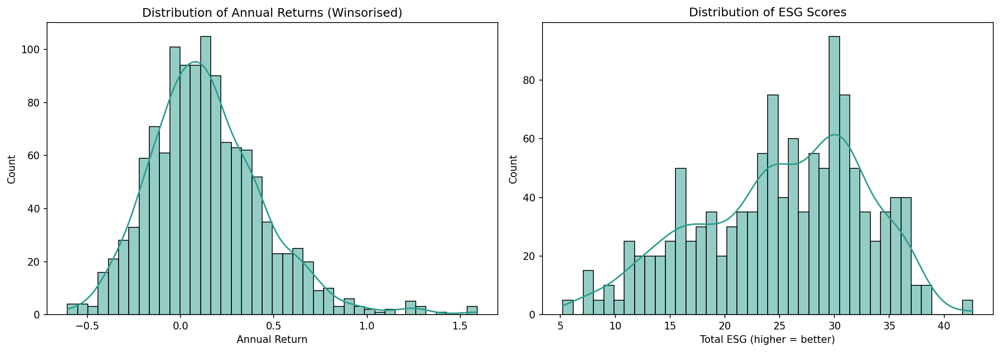

# ESG & Financial Performance Study

Econometric analysis examining the relationship between ESG (Environmental, Social, and Governance) ratings and financial performance across S&P 500 companies.

## Overview

This study applies panel data econometric methods to assess whether higher ESG ratings are associated with improved financial performance among S&P 500 constituents. The analysis uses both cross-sectional and panel regression approaches to control for firm-specific heterogeneity, with 5 years of annual returns merged with firm-level ESG risk scores.

## Methodology

- **Pooled OLS** with year fixed effects and firm-clustered standard errors
- **Random Effects** panel estimator with year dummies and firm-clustered standard errors
- Winsorisation of annual returns at the 1st/99th percentile
- ESG risk scores reversed so higher values indicate better ESG performance

## Tools & Libraries

- **Python** (pandas, NumPy, yfinance, statsmodels, linearmodels, matplotlib, seaborn)
- S&P 500 constituent scraping from Wikipedia
- Panel data econometric estimation

## Key Outputs

- Descriptive statistics and pooled correlations
- OLS and Random Effects regression tables with clustered standard errors
- Distribution plots of returns and ESG scores
- Year-by-year ESG vs. returns scatter plots with trendlines
- Residual diagnostics

## Sample Output

## Module

Programming for Finance — MSc Finance & Financial Technology, Henley Business School

## Usage

Open [`esg_financial_performance_study.ipynb`](esg_financial_performance_study.ipynb) for the full analysis. The ESG dataset (`SP500_esg_snapshot.csv`) is included in the repository.
